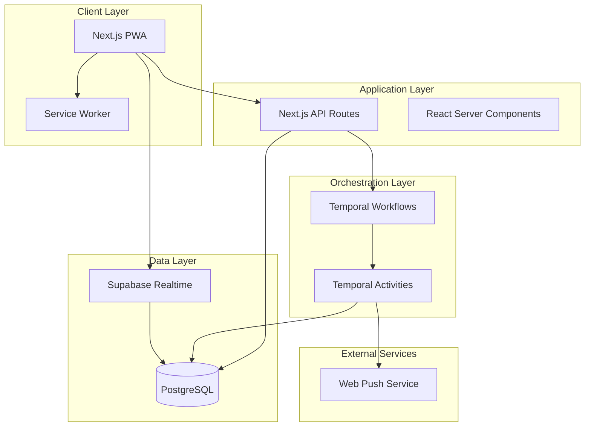
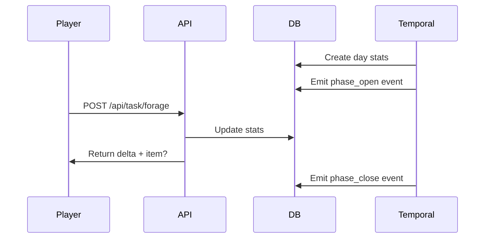
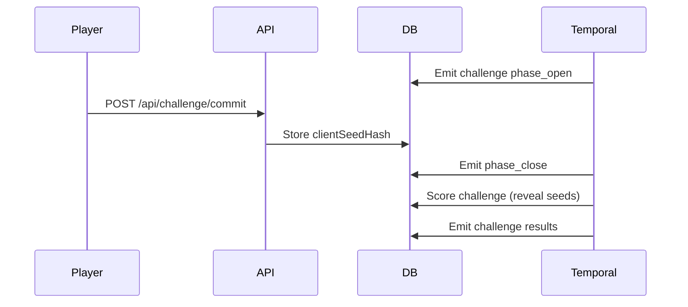
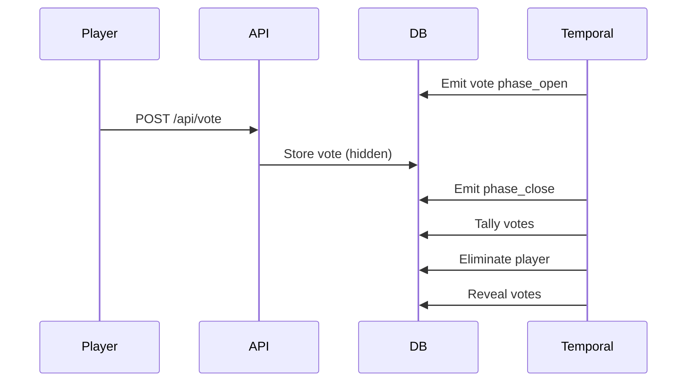

# Castaway Council - Architecture

## System Architecture



## Component Breakdown

### Frontend (PWA)
- **Next.js 14 App Router**: Server and client components
- **Service Worker**: Offline support, push notifications
- **Tailwind CSS**: Styling with dark mode support
- **Realtime Subscriptions**: Via Supabase client

### Backend (API Routes)
- **Task Management**: `/api/task/*` - forage, water, rest, help
- **Challenge System**: `/api/challenge/*` - commit-reveal protocol
- **Voting**: `/api/vote` - tribal council votes
- **Social**: `/api/confessional` - private diaries
- **Push**: `/api/push/subscribe` - notification subscriptions

### Orchestration (Temporal)
- **Season Workflow**: Main game loop orchestrator
- **Activities**:
  - Phase management (open/close)
  - Challenge scoring
  - Vote tallying
  - Merge detection
  - Daily summaries

### Database (PostgreSQL + Drizzle)
- **Schema**: 14 tables with relations
- **RLS Policies**: Row-level security for privacy
- **Event Sourcing**: Phase transitions in `events` table
- **Migrations**: Drizzle Kit for schema evolution

### Realtime (Supabase)
- **Channels**:
  - `season:{id}:public` - Public events
  - `tribe:{id}:chat` - Tribe-only chat
  - `dm:{pairKey}` - Direct messages
- **Presence**: Who's online in tribe chats

## Data Flow

### Camp Phase


### Challenge Phase


### Vote Phase


## Game Logic

### Commit-Reveal RNG

```typescript
// Client commits
clientSeed = random()
clientSeedHash = SHA256(clientSeed)
→ POST /api/challenge/commit

// Server scores
serverSeed = random()
roll = HMAC_SHA256(serverSeed, clientSeed || encounterId || playerId) % 20 + 1

// Publish both seeds for verification
```

### Challenge Scoring

```typescript
total = D20_roll
      + floor(energy / 20)     // 0-5 bonus from energy
      + itemBonus               // Tools, advantages
      - hungerPenalty           // < 30 hunger = -2
      - thirstPenalty           // < 30 thirst = -2
      - debuffs                 // Tainted water, exhaustion
```

### Voting Rules

1. All non-eliminated players vote
2. Winning tribe (from challenge) is immune
3. Idol play negates votes against owner
4. Most votes → elimination
5. Tie → revote or fire-making

## Deployment

### Docker Compose Services

```yaml
services:
  postgres:      # Main database
  temporal:      # Workflow orchestrator
  temporal-ui:   # Workflow monitoring
  web:           # Next.js app
  temporal-worker: # Workflow executor
```

### Environment Variables

```bash
DATABASE_URL              # PostgreSQL connection
NEXT_PUBLIC_SUPABASE_URL  # Supabase endpoint
TEMPORAL_ADDRESS          # Temporal server
VAPID_PUBLIC_KEY          # Web Push public key
VAPID_PRIVATE_KEY         # Web Push private key
FAST_FORWARD_MODE         # Dev/test acceleration
```

## Scalability Considerations

1. **Temporal**: Handles millions of concurrent workflows
2. **PostgreSQL**: Can be sharded by season
3. **Supabase Realtime**: Scales horizontally
4. **Next.js**: Edge deployment via Vercel
5. **Caching**: Add Redis for session/realtime data

## Security

1. **Authentication**: Supabase Auth (not yet implemented)
2. **Authorization**: RLS policies on all tables
3. **Input Validation**: Zod schemas on all endpoints
4. **RNG Verification**: Public seed publication
5. **Rate Limiting**: Per-user, per-endpoint (to implement)

## Monitoring

1. **Temporal UI**: Workflow execution history
2. **Database Metrics**: Query performance, connection pool
3. **API Logs**: Request/response logging
4. **Error Tracking**: (Sentry integration recommended)
5. **Analytics**: Player engagement, challenge participation

## Testing Strategy

1. **Unit Tests**: Game logic (RNG, scoring, voting)
2. **Integration Tests**: API routes with test DB
3. **E2E Tests**: 18 bot players, fast-forward mode
4. **Load Tests**: Concurrent season stress test
5. **Verification Tests**: RNG replay from published seeds
